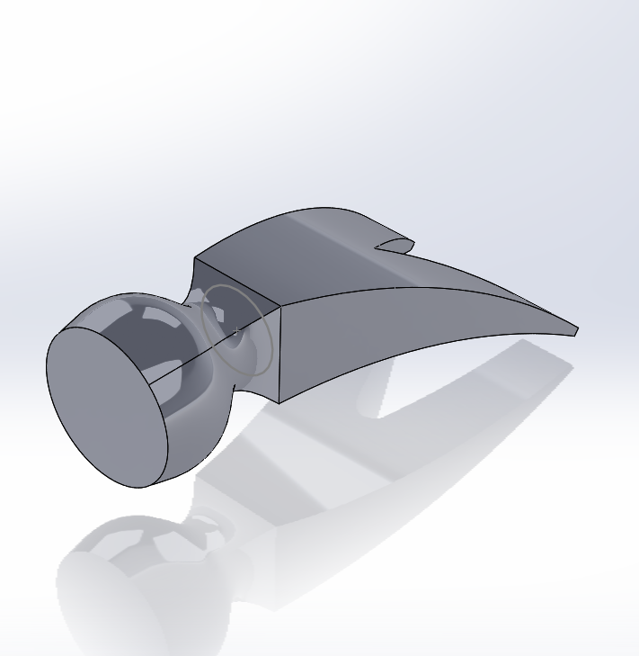
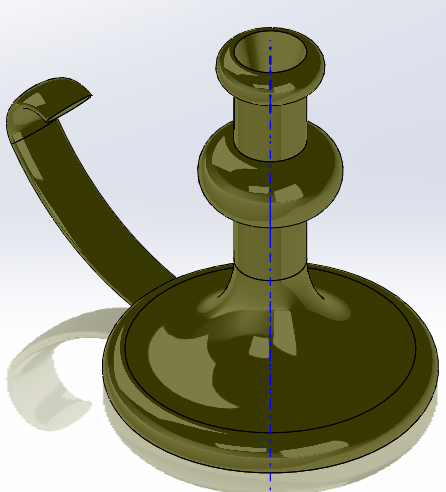

# NotSoBasicCad
## Base
### Description

### Picture

## Hammer
### Description
This was one of my first SolidWorks assignment. In this assignment we had to create a hammer head. This assignment was pretty straight through when I learned how to used lofted cut.

### Picture

### Lessons Learned / Tips for the future reader:
One lesson I learnd during this assignment is that Lofted cut is your best friend when you want to make a wedge on something.
## Candle stick
### Description 
in this assignment I had to create a candle holder. 
### Picture

